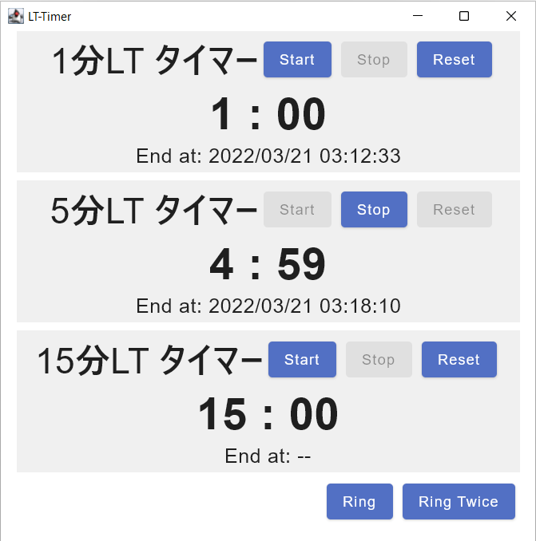

# LT-Timer
 first try with Kotlin.

## 機能

1分, 5分, 7分, 15分のタイマーです。

5分では残り1分(4分経過), 7分では残り2分(5分経過), 15分では残り2分(13分経過)にそれぞれ1回ベルが鳴ります。

終了時には2回ベルが鳴ります。

## ビルド

ビルドの際は、`src/main/kotlin/resouces`下にベル音は`bell.wav`、スタート音(スタートボタンを押したときの音)は`start.wav`を置いてください。

IntelliJ IDEAを使っています。
- Kotlin
- Compose for Desktop

memo: バージョンアップ時は、`build.gradle.kts`の`version`と`packageVersion`を変更する。

## Thanks

### 使用している音源

- ベル音: [効果音 呼び出しベル＜ベル・鐘・鈴＜道具＜『 生活系音 』 by On-Jin ～音人～](https://on-jin.com/sound/listshow.php?pagename=sei&title=%E5%91%BC%E3%81%B3%E5%87%BA%E3%81%97%E3%83%99%E3%83%AB&janl=%E7%94%9F%E6%B4%BB%E7%B3%BB%E9%9F%B3&bunr=%E3%83%99%E3%83%AB%E3%83%BB%E9%90%98%E3%83%BB%E9%88%B4&kate=%E9%81%93%E5%85%B7 )
- スタート音: [システム40 | フリー効果音無料ダウンロード 魔王魂](https://maou.audio/se_system40/)

